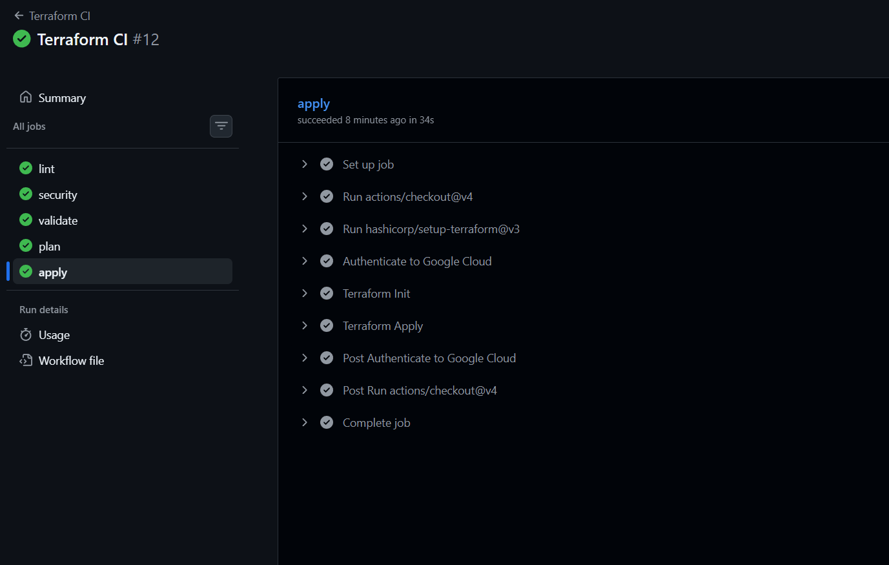
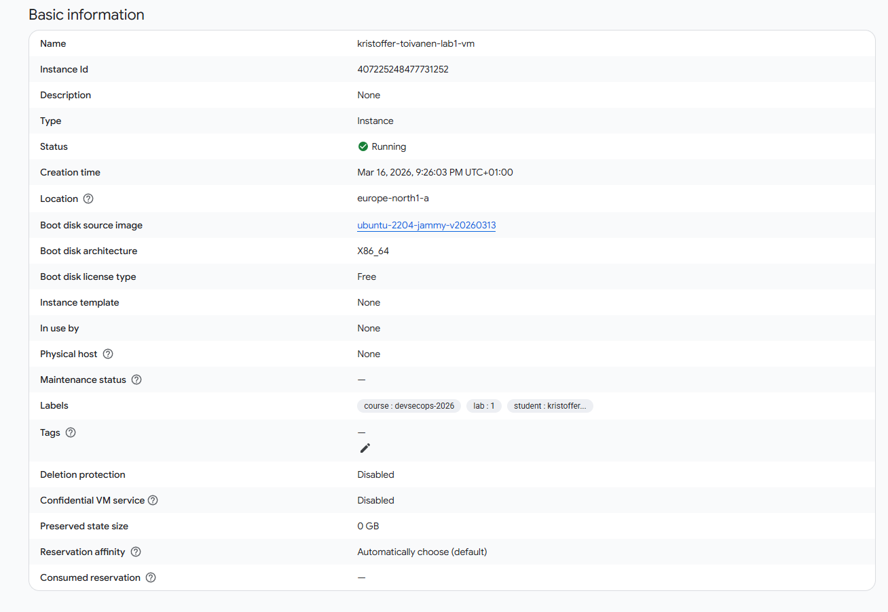

# lab1-terraform

DevSecOps Lab 1 med Terraform och Google Cloud Platform (GCP).

## CI-resultat (Pull Request)

Nedan visas en pipeline-körning där alla steg passerar, inklusive `apply`.



## VM i GCP Console

Nedan visas den skapade VM-instansen i GCP Console.



## Syfte

Målet med labben är att provisionera en säker grund-VM i GCP med Terraform samt lägga till automatisk backup av boot-disken.

## Filer som skapats/använts

- `main.tf` – provider, VM-resurs, backup policy och policy-attachment till disk.
- `variables.tf` – in-variabler för projekt, region och student-id.
- `terraform.tfvars` – värden för variabler (projekt/region/student).
- `startup.sh` – härdning vid uppstart (UFW, fail2ban, unattended-upgrades).
- `outputs.tf` – outputs för VM-namn, extern IP och zon.
- `.gitignore` – ignorerar state-filer, `.terraform/` och tfvars-filer.
- `.terraform.lock.hcl` – provider-låsfil skapad av `terraform init`.

## Det som är implementerat

1. Konfigurerat Google-provider (`hashicorp/google`, `~> 5.0`).
2. Definierat VM (`e2-micro`) i `europe-north1-a` med Ubuntu 22.04 LTS.
3. Lagt till startup-script för grundläggande serverhårdning.
4. Märkt resurser med labels/tags för kurs, labb och student.
5. Skapat daglig snapshot-policy (`03:00`) med 7 dagars retention.
6. Kopplat backup-policy till VM:ens disk.

## Testat/verifierat

- `terraform init` körd framgångsrikt.
- `terraform validate` körd med resultat: konfigurationen är giltig.
- `terraform plan` körd med resultat: 3 resurser planeras att skapas.
- `terraform apply` körd via GitHub Actions med Service Account-nyckel (`GCP_SA_KEY`).

## CI/CD-automation

Deploy sker nu automatiskt vid merge/push till `main`:

- `lint` -> `security` -> `validate` -> `plan` -> `apply`
- Ingen manuell uppladdning/körning krävs vid merge.

## Planerade resurser (enligt senaste plan)

- `google_compute_instance.vm`
- `google_compute_resource_policy.daily_backup`
- `google_compute_disk_resource_policy_attachment.backup_attachment`

## Körning

### 1) Initiera Terraform

Laddar ner och låser provider-versioner enligt konfigurationen.

```bash
terraform init
```

### 2) Granska planerade ändringar

Visar exakt vilka resurser som kommer skapas/ändras/tas bort utan att göra ändringar i molnet.

```bash
terraform plan
```

Tips: spara planen till fil om du vill applicera exakt samma plan senare.

```bash
terraform plan -out=tfplan
```

### 3) Applicera infrastrukturen

Skapar resurserna i GCP enligt planen.

```bash
terraform apply
```

Om du har sparat en planfil:

```bash
terraform apply tfplan
```

### Remote state (GCS backend)

Projektet använder `backend "gcs"` i Terraform. Initiera med backend-config:

```bash
terraform init -backend-config="bucket=<din-tf-state-bucket>" -backend-config="prefix=lab1-terraform"
```

I GitHub Actions används repository variables:

Workflowen använder som standard:

- `TF_STATE_BUCKET=chas-tf-state-chas-ff`
- `TF_STATE_PREFIX=lab1-terraform`


## Notering

`.terraform.lock.hcl` ska normalt checkas in i Git för reproducerbara provider-versioner.

## GitHub Secrets och Variables

För att alla workflows ska fungera (CI, auto-apply, destroy, CIS-audit) behövs följande på repo-nivå:

### Repository Secrets

- `GCP_SA_KEY` – JSON-nyckel för Service Account med rätt IAM-behörigheter.

### Repository Variables

- `TF_VAR_project_id` – exempel: `chas-devsecops-2026`
- `TF_VAR_region` – exempel: `europe-north1`
- `TF_VAR_student_id` – exempel: `kristoffer-toivanen`

### Inbyggda standardvärden i workflows

Följande backend-värden är redan hårdkodade i workflow-filerna:

- `TF_STATE_BUCKET=chas-tf-state-chas-ff`
- `TF_STATE_PREFIX=lab1-terraform`

## Säkerhetsbeslut

- `ufw`: begränsar inkommande trafik (default deny) och tillåter endast SSH.
- `fail2ban`: minskar risken för brute-force-attacker mot SSH.
- `unattended-upgrades`: installerar säkerhetsuppdateringar automatiskt.
- `auditd`: aktiverat för bättre spårbarhet/audit.
- SSH-härdning: root-login avstängt och password authentication avstängd.
- Labels/tags: gör resurser spårbara och enklare att hantera i drift.

## DR (RPO/RTO)

DR-dokumentation finns i [docs/dr.md](docs/dr.md) med:

- RPO: 24 timmar
- RTO: 30-60 minuter
- Runbook för restore från snapshot

## Auto-destroy workflow

Manuell destroy-workflow finns i [.github/workflows/terraform-destroy.yml](.github/workflows/terraform-destroy.yml).

Körning i GitHub Actions:

1. Actions -> `Terraform Destroy`
2. `Run workflow`
3. Skriv `destroy` i `confirm_destroy`

## CIS-audit workflow

Manuell CIS-audit finns i [.github/workflows/cis-audit.yml](.github/workflows/cis-audit.yml).

Körning i GitHub Actions:

1. Actions -> `CIS Audit`
2. `Run workflow`
3. Ange `vm_name` (exempel: `kristoffer-toivanen-lab1-vm`) och `vm_zone`
4. Ladda ner artifact `cis-audit-report` (innehåller `lynis-report.dat` och sammanfattning)

## Checklista för Godkänt (Labb 1)

- [x] Terraform-kod för Linux VM i GCP.
- [x] GitHub repo `lab1-terraform` med commit-historik.
- [x] GitHub Actions pipeline med lint, security scan, validate.
- [x] Minst en PR med synlig pipeline-körning (screenshot).
- [x] Backup-strategi (snapshot policy i Terraform).
- [x] README med förklaring och screenshots.

## VG-kompletteringar (status)

- [x] Pipeline blockerar `CRITICAL` (Trivy `exit-code: 1`).
- [x] DR-dokumentation (RPO/RTO) i [docs/dr.md](docs/dr.md).
- [x] Remote state via GCS backend.
- [x] Manuell auto-destroy workflow.
- [x] CIS-audit workflow + rapport-artifact för verifiering av hardening-score.
